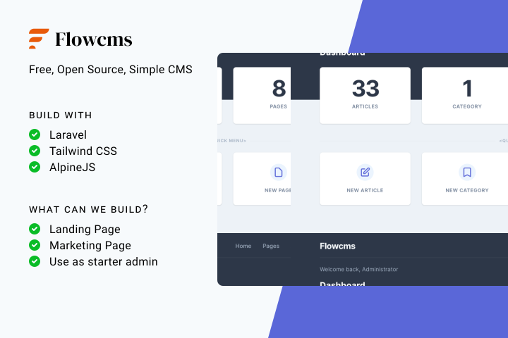

# FlowCMS

<p align="center">
	
</p>

## What is Flowcms?

FlowCMS is a free, open source, simple content management powered by **Laravel**, **AlpineJS** and **TailwindCSS**. Built for developers for running blogs, landing pages, use as starter admin panel and many more.

## Installation Steps

### 1. Require the Package

After creating your new Laravel application you can include the Flowcms package with the following command:

```bash
composer require flowcms/flowcms
```

### 2. Add the DB Credentials & APP_URL

Next make sure to create a new database and add your database credentials to your .env file:

```
DB_HOST=localhost
DB_DATABASE=homestead
DB_USERNAME=homestead
DB_PASSWORD=secret
```

You will also want to update your website URL inside of the `APP_URL` variable inside the .env file:

```
APP_URL=http://localhost:8000
```

### 3. Run The Installer

```bash
php artisan flowcms:install
```

And we're all good to go!

Start up a local development server with `php artisan serve` And, visit [http://localhost:8000/](http://localhost:8000/).

## Logging in to the Admin Panel

A user should have been created for you with the following login credentials:

> **email:** `admin@admin.com`  
> **password:** `password`

NOTE: Please ensure to change the password immediately after the first login.

## Usage

```php
// Usage description here
```

### Testing

```bash
composer test
```

### Changelog

Please see [CHANGELOG](CHANGELOG.md) for more information what has changed recently.

## Contributing

Please see [CONTRIBUTING](CONTRIBUTING.md) for details.

### Security

If you discover any security related issues, please email abhisheksarmah660@gmail.com instead of using the issue tracker.

## Credits

-   [Abhishek Sarmah](https://github.com/abhisheksarmah)
-   [Mithicher Baro](https://github.com/mithicher)
-   [All Contributors](../../contributors)

## License

The MIT License (MIT). Please see [License File](LICENSE.md) for more information.

## Laravel Package Boilerplate

This package was generated using the [Laravel Package Boilerplate](https://laravelpackageboilerplate.com).
